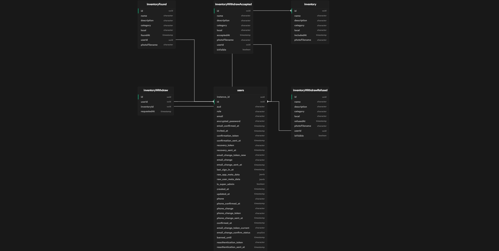

<h1 align="center">
    
</h1>

<h4 align="center"> 
	:heavy_check_mark:  Next Level Week Copa ⚽🚀 Done! :heavy_check_mark:
</h4>
<p align="center">
  

<a href="https://www.linkedin.com/in/fellipeutaka/">
    
  </a>

<a aria-label="Completed" href="https://lp.rocketseat.com.br/nlw">
    </img>
  </a>

<a href="https://github.com/fellipeutaka/encontrei/commits/master">
    
  </a>


   <a href="https://github.com/fellipeutaka/encontrei/stargazers">
    
  </a>
</p>
<p align="center">
  <a href="#-project">Project</a>   |   
  <a href="#rocket-Technologies">Technologies</a>   |   
  <a href="#-how-to-use">How to use</a>   |   
  <a href="#-how-to-contribute">How to contribute</a>   |   
  <a href="#memo-license">License</a>   |   
</p>

## 💻 Project

Encontrei (Found it) is a desktop and mobile application to help people to recover your belongs and to manage lost items.

<h1 align="center">
    
</h1>

## 🚀 Technologies

This project was developed with the following technologies:

- [TypeScript][ts]
- [Node.js][node]
- [Electron][electron]
- [Supabase][supabase]
- [React][react]
- [TailwindCSS][tailwind]
- [React Native][rn]
- [Expo][expo]

## ℹ️ How To Use

To clone and run this application, you'll need [Git][git], [Node.js][node] + [Yarn][yarn] installed on your computer.

From your command line:

```bash
# Clone this repository
$ git clone https://github.com/fellipeutaka/encontrei.git

# Install dependencies
$ yarn

# Generate Prisma Client types
$ yarn server prisma generate

# Start server
$ yarn dev
```

## 🤔 How to contribute

1. Fork this repository.
2. Create a branch: `git checkout -b <branch_name>`.
3. Make your changes and commit them: `git commit -m '<commit_message>'`
4. Push to original branch: `git push origin <project_name> / <local>`
5. Create the pull request.

Or, see the GitHub documentation on [how to create a pull request](https://help.github.com/en/github/collaborating-with-issues-and-pull-requests/creating-a-pull-request).

## 📝 License

This project is under the MIT license. See the [LICENSE](https://github.com/fellipeutaka/encontrei/blob/master/LICENSE) for details.

Made with ♥ by Fellipe Utaka 👋 [Get in touch!](https://www.linkedin.com/in/fellipeutaka/)

[figma]: https://www.figma.com/file/kwLAEZmyDB2NuvMNi87XGF/Bol%C3%A3o-da-Copa-(Community)
[node]: https://nodejs.org/
[supabase]: https://supabase.com/
[electron]: https://www.electronjs.org/
[ts]: https://www.typescriptlang.org/
[expo]: https://expo.dev/
[react]: https://reactjs.org
[tailwind]: https://tailwindcss.com/
[rn]: https://reactnative.dev/
[yarn]: https://yarnpkg.com/
[git]: https://git-scm.com
